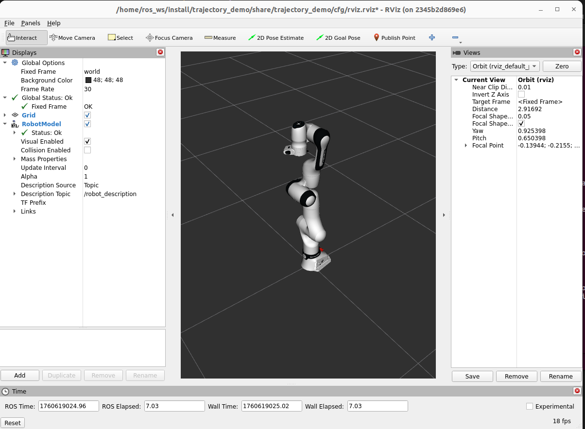
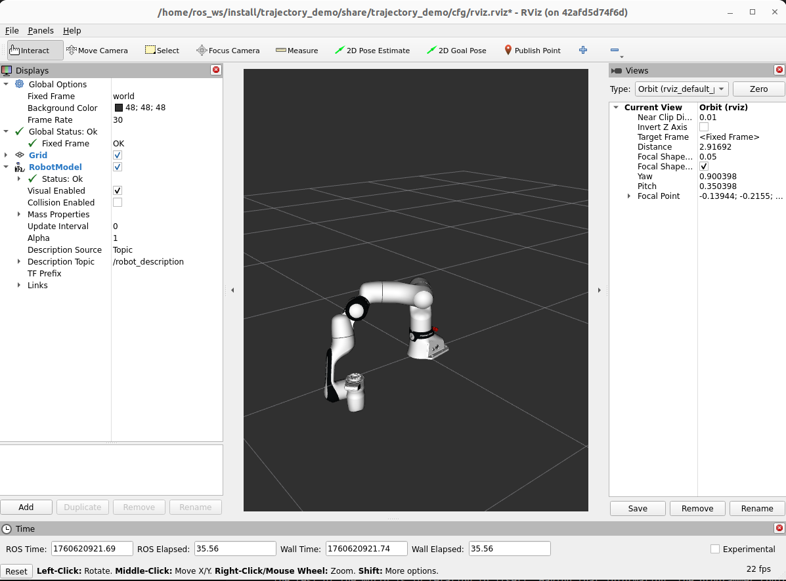

# COMP0246_labs

This repo holds lab(s) for COMP0246. It uses ROS2 humble.

## lab -1 Trajectory

In this work we will explore trajectory planning using both the Kinematics and Dynamics (KDL) Library ([docs](https://docs.ros.org/en/indigo/api/orocos_kdl/html/index.html)) for inverse kinematics and the tf2 ([docs](https://docs.ros.org/en/humble/Tutorials/Intermediate/Tf2/Introduction-To-Tf2.html)) library to do forward kinematics.




### step 0

You will need a ROS Humble installation with the below libraries. If you have a MAC or Windows machine, you will save yourself time and effort by running Linux natively by finding a computer you can install linux on either borrowing one or booting off of a flashdrive. Else, please install Virtual Box ([here](https://www.virtualbox.org/)) and an Ubuntu 22.04 image, then install docker engine within that image ([here](https://docs.docker.com/engine/install/ubuntu/)).

From here, download the repo.

```
cd ~
git clone https://github.com/surgical-vision/COMP0246_labs
```

And run the docker image taking care to pass the repo to the ros workspace and to let docker access your GUI interfaces to be able to see RVIZ2. Users with ARM processors may need to use the docker image `ghcr.io/sloretz/ros:humble-desktop-full` which supports ARM Processors ([here](https://github.com/sloretz/ros_oci_images)) instead of the official ROS2 docker image `osrf/ros:humble-desktop-full`. If you have ROS2 installed natively you can also run the activities using that install instead of docker, for users unfamiliar with docker this may be easier.
```
xhost +local:root && docker run -it --rm -v $HOME/COMP0246_labs:/home/ros_ws/src/COMP0246_labs --env="DISPLAY" \
    --env="QT_X11_NO_MITSHM=1" \
    --volume="/tmp/.X11-unix:/tmp/.X11-unix:rw" \
    osrf/ros:humble-desktop-full && xhost -local:root
cd home/ros_ws
colcon build --symlink-install
```

Now we install libraries that are dependencies inside of the docker image
```
sudo apt-get update && sudo apt-get install ros-humble-python-orocos-kdl-vendor ros-humble-orocos-kdl-vendor ros-humble-kdl-parser ros-humble-joint-state-publisher-gui ros-humble-controller-manager ros-humble-joint-trajectory-controller ros-humble-joint-state-broadcaster ros-humble-ros2-control ros-humble-ros2-controllers 
```

Now we bring up the simulation for the first time. This should produce a window similar to the first screenshot in this section. 
```
source install/setup.bash
ros2 launch trajectory_demo bringup.launch.py urdf_package:=franka_description urdf_package_path:=urdfs/fr3.urdf rviz_config_package:=trajectory_demo rviz_package_path:=cfg/rviz.rviz
```

Now in a new terminal on your ubuntu VM, we access the docker container a second time and publish an example trajectory. The robot should move.
```
docker exec -it $(docker ps -lq) bash
cd home/ros_ws
source install/setup.bash
ros2 topic pub -1 /franka_arm_controller/joint_trajectory trajectory_msgs/msg/JointTrajectory "{joint_names: ['fr3_joint1', 'fr3_joint2', 'fr3_joint3', 'fr3_joint4', 'fr3_joint5', 'fr3_joint6', 'fr3_joint7'], points: [{positions: [0.0, 1.0, 0.0, 0.0, 1.0, 1.0, 0.0], time_from_start: {sec: 1.0}}]}"
```

### step 1

From here we start the lab. The first task is to implement the needed code to follow cartesian waypoints and plot the ensuing trajectory. The node to edit is in the `trajectory_demo` package under `trajectory_demo/traj_demo.py`. It reads in a config file in the `trajectory_demo` package, namely `cfg/traj_waypoints.yaml`. Note the intial goal in this config file. Fill in the items marked with `#TODO` in the ROS node and then run first the launch file and then second the node to see the robot arm move to the goal. To re-run with config and/or code updates you may need to re-build the ros workspace. Note that the plotting function will run once you exit the node with a keyboard interupt (ctrl+c) so wait for the arm to reach the goal and then ctrl+c.

```
ros2 run trajectory_demo traj_demo --ros-args -p base_link:=base -p ee_link:=fr3_link8 -p traj_cfg_pkg:=trajectory_demo -p traj_cfg_path_within_pkg:=cfg/traj_waypoints.yaml
```

It should result in the end effector meeting the goal position (with no regard for collisions or orientation).



Submit your trajectory plotted. Note to get a file out of a docker container you will need to save it to a volume mount, so save it to the COMP0246_Labs directory inside of the `ros_ws/src` folder which is mounted. This will let you access an image from outside of the docker container.


### step 2

From here modify the configuration to draw the first letters of each person's name in your group. Include in the report one plot per teamate with the trajectory from their initial. Include also, the config used to achieve this. Include also the time that the trajectory takes to run (by adding a timer). Hints: be mindful of the robot's workspace, not all cartesian points can be reached by the robot. Also be mindful that passing points closer together will often result in a cleaner final trajectory.


### step 3

Modify the configuration file at `cfg/traj_waypoints.yaml` to include orientation targets in addition to position targets, and modify the node `trajectory_demo/traj_demo_student.py` to respect these targets. Choose one trajectory from an earlier section and re-run it including orientation targets. Plot both cartesian position and orientation and submit both plots.

### step 4

Imagine a scenario with a robot with a plasma-cutter attached to the end effector that is tasked with cutting out shapes from sheet metal. There are obstacles in the robot's workspace and orientation of the plasma cutter matters to achieve a clean cut. Describe (but do not implement) control strategies you could implement to cut out such shapes and highlight how they differ from strategies used in this lab. This response should be roughly half a page in length.


