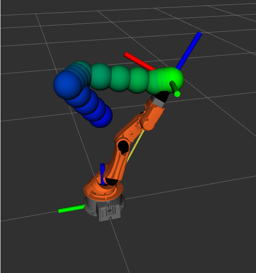

# COMP0246_labs

This repo holds lab(s) for COMP0246. It uses ROS2 humble. ** You will need your implementation of transform_helpers from the previous lab**

## lab1_youbot_kinematics
For this lab, we will implement forward and inverse kinematics for the KUKA YouBot manipulator. We will then implement path planning for this robot.

### Part 1.a

For this activity, we will need to implement methods to do forward kinematics as well as to get the jacobian and to tell whether a given pose is a singularity.

#### 1.a.i - Implement FK
Inside the `youbot_kinematics` package please modify the `youbotKineBase.py`. There are TODO items marked to implement forward kinematics and to convert rotation matrices.

#### 1.a.ii - Implement Jacobian and Singularity Methods
Inside the `youbot_kinematics` package please modify the `youbotKineStudent.py`. There are TODO items marked to jacobian and singularity methods.

To test your work from 1.a.i and 1.a.ii, in one terminal run `ros2 launch youbot_kinematics bringup.launch.py` and in another terminal run `ros2 run youbot_kinematics main_student`. 

For 1.a.i you should see something like the below screenshot where the frame with the post-fix `student` is correctly tracking the end effector as you move the joint angles using the GUI.


For 1.a.ii you should see jacobian matrices printed out in the terminal before the node starts running. You may compare your work to the below:

To test your work you may compare to the below expected output. You will also rely on this work in the next section.

```
target joint angles
[4.708484383458099, 1.3752175535418365, -3.214261824370574, 1.7887614596312122, 1.7302036080836274]
pose
[[ 0.85904569  0.50707718  0.07009449  0.01085649]
 [-0.4887534   0.77176915  0.4068077   0.06300784]
 [ 0.15218614 -0.38372532  0.91082065  0.58617778]
 [ 0.          0.          0.          1.        ]]
jacobian
[[ 6.30078446e-02 -7.49126877e-02 -4.93525262e-02 -2.84716875e-02
   2.08166817e-17]
 [-1.08564869e-02 -4.34771120e-01 -2.86427490e-01 -1.65241267e-01
  -3.46944695e-18]
 [ 0.00000000e+00  9.69363104e-02  1.33893658e-01  7.81900667e-02
   0.00000000e+00]
 [ 0.00000000e+00  9.85478270e-01  9.85478270e-01  9.85478270e-01
  -7.00944853e-02]
 [ 0.00000000e+00 -1.69801586e-01 -1.69801586e-01 -1.69801586e-01
  -4.06807696e-01]
 [-1.00000000e+00  0.00000000e+00  0.00000000e+00  0.00000000e+00
  -9.10820653e-01]]
target joint angles
[4.054210505693871, 0.7992699204278928, -2.288749607899941, 1.2692020100313526, 2.645584347531603]
pose
[[ 0.61301984  0.74576626 -0.26084355 -0.06214197]
 [-0.577254    0.64819831  0.49660525  0.11830858]
 [ 0.53942979 -0.15385589  0.82785498  0.57801772]
 [ 0.          0.          0.          1.        ]]
jacobian
[[ 1.18308582e-01  2.01357435e-01  1.33292245e-01  7.06960205e-02
  -2.08166817e-17]
 [ 6.21419731e-02 -3.83353013e-01 -2.53767554e-01 -1.34594148e-01
  -8.67361738e-18]
 [ 0.00000000e+00  1.66635869e-01  1.15648236e-01  1.05430014e-01
  -8.67361738e-19]
 [ 0.00000000e+00  8.85305594e-01  8.85305594e-01  8.85305594e-01
   2.60843548e-01]
 [ 0.00000000e+00  4.65009684e-01  4.65009684e-01  4.65009684e-01
  -4.96605255e-01]
 [-1.00000000e+00  0.00000000e+00  0.00000000e+00  0.00000000e+00
  -8.27854978e-01]]
```


### Part 1.b
For this part of the lab we will use the jacobian implementation from your earlier work to calculate inverse kinematics and trajectories.

#### 1.b
The file `plan_trajectory.py` has many TODO items for you to implement. At a high level we are taking in target positions in joint angles, we need to calculate cartesian poses of the end effector, split these into checkpoints using decoupling techniques, and then publishing a trajectory of these checkpoints. Once you have implmented these methods you can visualize your work by using:

```
ros2 launch youbot_kinematics bringup.launch.py
```

And in a second terminal:
```
ros2 run youbot_kinematics plan_trajectory
```

You should see a trajectory like the one below.


### Part 1.c

For this part of the lab you will implement a node that listens to your trajectory and publishes the transform to the end effector.

To do this, create a new node in the `youbot_kinematics` package. This node should listen to the `JointTrajectory` messages that you publish from the `plan_trajectory` node and then use the `YoubotTrajectoryFollower` to do forward kinematics on the joint positions, wait an appropriate time between checkpoints, and then publish the transform. For this section the tutorial [here](https://docs.ros.org/en/humble/Tutorials/Beginner-Client-Libraries/Writing-A-Simple-Py-Publisher-And-Subscriber.html) may come in handy.

The end result is that running all three programs should result in you seeing the coordinate frame of the end effector follow the waypoints, though the robot model will not move. We do not publish intermediate transforms for the robot model, because we do not align our DH frames with the robot model frames.



### Part 1.d

Modify the `target_data.py` file, adding more targets or changing the trajectory. Run your program and ensure the end effector frame follows it. Include a screenshot of your changed trajectory and end effector frame.
